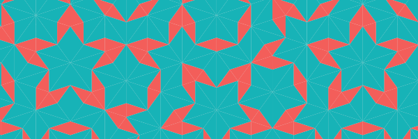
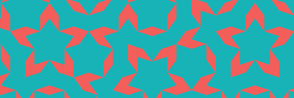

```{r, include = FALSE}
knitr::opts_chunk$set(
  collapse = TRUE,
  comment = "#>"
)
options(rmarkdown.html_vignette.check_title = FALSE)
```

When using `geom_polygon`, you might get lines between the polygons. These artifacts don't happen all the time and seem to occur more often between shapes of the same color and on macOS. This vignette walks through different attempts to resolve them.

## Libraries

```{r libraries, message = FALSE}
library(penrosetiling)
library(tidyverse)
```

## Lines Between Polygons

This section sets up the data set and output image.

```{r lines_1, fig.align = 'center', fig.height = 2, fig.width = 7}
tiles <- return_rhombus(0, 0, -90 + 36, 100, 'T') %>%
  substitution() %>%
  substitution() %>%
  substitution() %>%
  substitution() %>%
  substitution() %>%
  substitution() %>%
  substitution() %>%
  pivot_down()

ggplot(tiles) +
  geom_polygon(aes(x = x,
                   y = y,
                   fill = shape,
                   group = triangle)) +
  coord_equal()
```

Saving this image as a png file and then zooming in shows the following image. We can see the lines between polygons.

```{r zoom_1, echo = FALSE, fig.align = 'center'}

```

## Attempts

The following code snippets attempt to solve this issue. They only show the zoomed-in output. So, the code won't match the image but does start the process.

### Add `color` to aesthetic mapping.

```{r lines_2, eval = FALSE}
ggplot(tiles) +
  geom_polygon(aes(x = x,
                   y = y,
                   color = shape,
                   fill = shape,
                   group = triangle)) +
  coord_equal()
```
```{r zoom_2, echo = FALSE, fig.align = 'center'}

```

Unfortunately, the corners won't match based on the order shapes are drawn.

### Setting `color = NA`

```{r lines_3, eval = FALSE}
ggplot(tiles) +
  geom_polygon(aes(x = x,
                   y = y,
                   fill = shape,
                   group = triangle),
               color = NA) +
  coord_equal()
```
```{r zoom_3, echo = FALSE, fig.align = 'center'}

```

Again, the lines still show.

### Change `lwd`

```{r lines_4, eval = FALSE}
ggplot(tiles) +
  geom_polygon(aes(x = x,
                   y = y,
                   color = shape,
                   fill = shape,
                   group = triangle),
               lwd = .5) +
  coord_equal()
```
```{r zoom_4, echo = FALSE, fig.align = 'center'}

```

If `lwd` is too large, the output looks messy. If `lwd` is too small, the lines show. Unfortunately, there isn't always an in-between option that fits.

### Set up background shapes

```{r lines_5, eval = FALSE}
ggplot(tiles) +
  geom_polygon(aes(x = x,
                   y = y,
                   color = shape,
                   fill = shape,
                   group = triangle)) + 
  geom_polygon(aes(x = x,
                   y = y,
                   fill = shape,
                   group = triangle),
               color = NA) +
  coord_equal()
```
```{r zoom_5, echo = FALSE, fig.align = 'center'}

```

This option works sometimes and looks fine in this case.

### Change image format

The following output changed from png to jpeg.

```{r lines_6, eval = FALSE}
ggplot(tiles) +
  geom_polygon(aes(x = x,
                   y = y,
                   color = shape,
                   fill = shape,
                   group = triangle)) + 
  geom_polygon(aes(x = x,
                   y = y,
                   fill = shape,
                   group = triangle),
               color = NA) +
  coord_equal()
```
```{r zoom_6, echo = FALSE, fig.align = 'center'}

```

No lines, but there's also a loss in resolution.

### Separate out shapes by color

```{r lines_7, eval = FALSE}
ggplot() +
  geom_polygon(data = tiles[tiles$shape == 'T', ],
               aes(x = x,
                   y = y,
                   color = shape,
                   fill = shape,
                   group = triangle)) +
  geom_polygon(data = tiles[tiles$shape == 't', ],
               aes(x = x,
                   y = y,
                   color = shape,
                   fill = shape,
                   group = triangle)) +
  coord_equal()
```
```{r zoom_7, echo = FALSE, fig.align = 'center'}

```

Since this draws all of one shape on top, they display a little chunky. However, it could work if you have few colors and like that style.

### Fill in background with bigger shapes

The following code increases the polygons' sizes in new variables, graphs the new larger shapes to cover up the lines, then places the original polygons on top to clean up the corners.

```{r lines_8, eval = FALSE}
tiles_background <- tiles %>%
  group_by(triangle) %>%
  mutate(center_x = mean(x), 
         center_y = mean(y)) %>%
  mutate(new_x = (x - center_x) + sign(x) * .075 + center_x,
         new_y = (y - center_y) + sign(y) * .075 + center_y)

ggplot(data = tiles_background) +
  geom_polygon(aes(x = new_x,
                   y = new_y,
                   fill = shape,
                   group = triangle)) +
  geom_polygon(aes(x = x,
                   y = y,
                   fill = shape,
                   group = triangle)) +
  coord_equal()
```
```{r zoom_8, echo = FALSE, fig.align = 'center'}

```

This one works out sometimes, but you'll have to play around with the size increase.

### Use the `ragg` package

This code saves the image using the `ragg` package with setting up background shapes.

```{r lines_9, eval = FALSE}
library(ragg)
agg_png(filename = here::here("third_example", "img.png"),
        width = 1500, height = 1500)
ggplot(data = tiles) +
  geom_polygon(aes(x = x,
                 y = y,
                 color = shape,
                 fill = shape,
                 group = triangle)) + 
  geom_polygon(aes(x = x,
                   y = y,
                   fill = shape,
                   group = triangle),
               color = NA) +
  coord_equal()
invisible(dev.off())
```
```{r zoom_9, echo = FALSE, fig.align = 'center'}

```

This one tends to look great.

### End

This vignette is not an exhaustive list of options. Some of them might work for your project, or you might need to figure out a better way.
